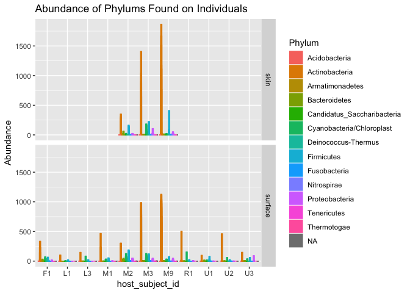
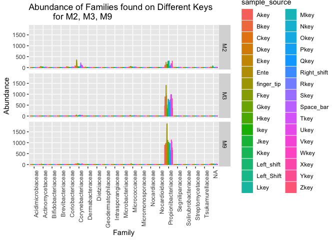
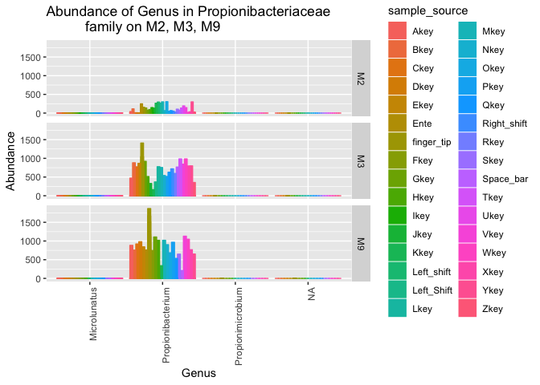
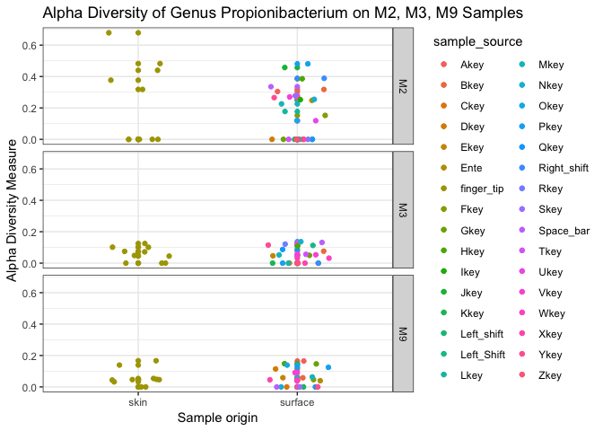

Analysis Report 1: Forensic Identification using single taxa distribution of skin bacterial communities
================
Maggie Chen
October 20, 2017

Introduction
============

Bacteria community constantly interacts with human communities, and it has both positive and negative impact on humans. For instance, microbial community in human's gut is a typical example of how the human can benefit from bacteria. The microbial community in human's gut support metabolic activities, which will help the provide energy and provide nutrients for human's body. The microbial community in the gut also help provide immune protection against alien microbes (McMurdie and Holmes, 2013). There also a lot of diseases caused by bacteria. For example, periodontist as an oral infection may be caused by bacterial infections, which is even related to systemic diseases, like cardiovascular disease (Guarner and Malagelada, 2003). Not only bacteria can impact human health, human can also function as a mediator of bacteria trans-infection. At different body parts, there is a variation of microbial community composition. The human intestinal habitat contains 300 to 500 different bacteria species, which performs different functions. Around 90% of the adult gut bacteria community is composed of *Firmicute* or *Bacteroidetes* phyla, and the rest of it belongs to *Actinobacteria*, *Proteobacteria*, and several other phyla (Huttenhower *et al.*, 2012). However, skin provides a different habitat than gut, thus even in the same individual, there is a different microbial community composition. This difference is caused by many factors like oxygen level, PH, and immunological factors (Faust *et al.*, 2012). Different from gut, skin is dominated by *Staphylococcus* (Phylum Firmicutes), *Propionibacterium* or *Corynebacterium*(phylum *Actinobacteria*) (Huttenhower *et al.*, 2012). Human skin is a good carrier of bacteria, and transfer them onto surfaces through touching. Also, individual's living environment and lifestyle impacts the bacteria community on each person, which creates significant variations between individuals (Fierer *et al.*, 2010). What's more, skin bacteria communities are relatively stable over times (Fierer *et al.*, 2008). In addition, bacteria is capable of persisting on the touched surface for a certain amount of time, even under harsh storage conditions (Fierer *et al.*, 2010). This long-term persistence allows re-examination of microbial community available within certain time period.

Along with the fast development of sequencing techniques, the sequence and investigation on microbial communities have expanded extensively. High-throughput sequencing, also known as the Next Generation Sequencing(NGS) technology, that used the non-Sanger-based method to enable an unprecedented DNA sequencing speed. This also allows the novel biological sequencing applications. For example, 454 technique is known to have a crucial advantage of combing the emulsion PCR and pyrosequencing. For emulsion PCR, the single DNA amplification is a bias-free process, by avoiding the competition by multiple templates for a limited amount of DNA polymerase. Pyrosequencing, can be performed in parallel and produce a visual signal via computer system (Schuster, 2007). The next generation sequencing technique makes the DNA sequencing faster, which generates significantly more data for scientists to process. Thus, to process the massive amount of data, different methods are developed. One of the example and will be used in this paper is the Phylogenetic Sequencing (Phyloseq), which is a contingency table of taxonomic and samples, and integrate with other data types. This can be applied along with the powerful statistical and graphical tool R to enable more various data analysis (McMurdie and Holmes, 2013).

In addition to the health implication of understanding bacteria, another relatively new application of understanding microbe community is in the forensic examinations. Recent research has indicated that the microbial community can serve as additional evidence in forensic investigations of suspect identification (Fierer *et al.*, 2010). The combination of the high throughput sequencing technology and the characteristics of bacteria communities on human skins and how they persist on the touched surface makes it possible as a forensic identification method. Through comparing and matching the microbial community composition, the microbial community will serve as a "fingerprint" for the individual identification during forensic investigations (Fierer *et al.*, 2010).

The goal for this article is to explore an additional approach to analyze the microbial community for forensic identification supposes. My primary question is that instead of matching multiple communities between human skin and object been touched, how single taxa analysis can help with forensic identification. I hypothesize that in the male population, for the most abundant bacteria taxa will have a unique distribution on objects, in this case, the keyboards. This unique bacteria distribution will then function as a "fingerprint" for individual identification. To investigate this problem, R program is used for sequence analysis.

Methods
=======

Sample origin and sequencing
----------------------------

The samples are taken from three individuals in between age 20 and 35 by Fierer et al., that 25 to 30 keys on three person's computer keyboards are swabbed. Fierer et al. also swabbed their skin on the ventral surface of each fingertip's distal joint. As for the sample control, all three individuals are healthy and had not taken any antibiotics for at least past 6 month. Two of the individuals shared the same office space. Then communities on the keys were compared to the communities to the microbial communities on the owner's fingertip. To quantify the degree of association between the keyboard and its owner, versus keyboards not touched by the individual, Fierer et al. also sampled other individual keys from other public and private keyboards located on the University of Colorado campus. The sampling tools for both skin and keyboard keys are the autoclaves cotton-tipped swabs, that is premoistened by s sterile solution (Fierer *et al.*, 2008). As for the storage of the samples before DNA extraction, all swabs were stored at -80ºC for less than a week (Fierer *et al.*, 2010).

Then, the bacterial DNA was extracted from the swabbed samples, and the composition of the microbial community was determined by using the bar-code pyrosequencing technology. Fierer et al. used MO BIO PowerSoil DNA Isolation kit to extract genomic DNA from the swabs. For each sample, Fierer et al. amplified 16S rRNA genes using specific primers, which was optimized for the phylogenetic analysis. Fierer et al. also used PCR reaction in triplicated reactions with forward and reverse primers. The amplicon yielded from the PCR reaction was visualized on 0.1% agarose gels. Amplicons were then cleaned using the PCR Clean-up kit. The concentration of amplicon DNA was measured using the QUant-iT PicoGreen dsDNA reagent and kit. 454 Life Sciences Genome Sequencer FLX instrument performed by the Environmental Genomics Core Facility at the University of South Carolina for pyrosequencing (Fierer *et al.*, 2010).

Computational
-------------

I used DADA to analyze and clean the data, then phyloseq and ggplot to visualize the results. Firstly, I ran a quality control on all twenty of the sample data, which generated a quality profile on each of the samples. Then according to the sequence quality, I trimmed the data if they have more than three expected error, and has a quality lower than two. As a quality control, I created a table to compare the read counts before and after the trim to ensure I did not trim off too many sequences. After the trim, I build an error model for each sample to assess the probability of an unmatched base is an error or not, and a plot to check whether the error model matches the data. After it, I also deleted the duplicated sequences. Then as an essential step, I DADA to process the sequence data. DADA is an analysis include the error model and evaluates whether the unique sequence found is true or false. DADA eliminates the false positive results to provide the real variants and limit spurious sequence, to provide a high-resolution amplicon data (Callahan *et al.*, 2016).

Then I listed the output of the DADA analysis on a table according to the varirty of length. As well as a histogram to indicate the distribution of the sequence that is trimmed and denoised, to ensure that all the sequences are in acceptable length and quality. Using this output, I also removed all the chimeras, which is the cDNA sequence that generated from two transcripts that is caused by polymerase stuck and ump to another similar sequence. Using the sequence data, I assigned the taxonomy according to the supplied training set. I also created a phylogeny tree using the trimmed and denoised sequence data. Using the dada2 output, I charted a data set, which contains the metadata for each sample, Phylogeny, and taxonomy for each sequence. Then to enable the ggplot function, I combined the taxa and metadata into one table.

Results
=======

To answer the primary question that how can a single taxon function as additional forensic identification evidence. I first exampled the different abundance of phylum found on each individual’s samples. I categorized each individual’s samples into two types, samples from individual skin and keyboards. Throughout all individuals’ keyboards samples, *Actinobacteria* has significant higher abundance across all individuals. The second commonly found Phylum is *Firmicutes* (Figure1). As for the skin samples, only three individuals have skin sample available, for which it is consistent with keyboard samples that the *Actinobacteria* has a significant high abundance in all three individuals(Figure1). Since *Actinobacteria*, and *Firmicutes* are two most commonly found bacteria phylum, I further plotted their distributions on each key on the keyboards. Only three male individuals have all keys sampled, they are male individuals M2, M3, M9. For other individuals, only the space bar is sampled. The highest amount of *Actinobacteria* is found on the fingertip. M2, M3, M9 has a different distribution pattern of both bacteria on the keyboards(Figure2). *Actinobacteria* is found in a higher abundance across the keyboards and individual. Thus, to further investigate *Actinobacteria*, I plotted the families within phylum *Actinobacteria* according to the abundance found on each of the keys and fingertip. *Propionibacteriaceae* family has a significantly higher abundance in all individual sample across all keys and fingertips(Figure2). For M3 and M9, the fingertip is the location that has most of *Propionibacteriaceae* found. For M2, all keys and fingertip have relative lower abundance than M3 and M9. All three individuals have different distributions of Propionibacteriaceae on keys(Figure2). Since most of the family identified in samples are *Propionibacteriaceae*, and there are still distinct differences between each individual's bacteria distribution pattern on the keyboard. I further examined the Genus found on three male individuals. The Genus found are concentrated in *Propionibacterium*, and for M3, M9 two male individuals, the fingertip has the highest abundance. For all three individuals, there is also a different abundance distribution on the keys of the keyboards(Figure4). Then, the alpha diversity is measured for the sequences identified as Genus *Propionibacterium*. The samples are from both fingertip and the keyboard of the individual. One of the samples (M2) has a higher diversity in this Genus. And the fingertip in the same individual (M2) has higher diversity than its keyboard. For other two individuals (M3, M9), they have lower alpha diversity in the samples compare to M2. Also, for both M3 and M9, the fingertip and keyboards have a very similar alpha diversity(Figure5).

We can see from the quality profiles that most reads tend to get pretty bad in quality after around 200 bases.

The output table has 115 rows (samples) and 1539 columns (sequence variants). Notice how we can embed R code directly in our markdown text.

After removing chimeras, we were left with 99.97% of our cleaned reads.

**Figure1**: The abundance of taxa found on each individual and their keyboard samples, colored by Phylum. Separate by sample types, skin as the fingertip and surface as the keyboard. As the Figure presents, the most commonly found Phylum across all the individuals' keyboard samples is *Actinobacteria*, present in orange color. The second commonly found bacteria Phylum is *Firmicutes*. This is consistent with fingertip samples. The fingertip samples are only available for M2, M3, M9 individuals, who are all males. Other individuals do not have fingertip sample available, including F1 who is a female individual; for L1, L3, R1, U1, U2, U3 the sex of the individual is not applicable, which are the sample taken by Fierer et al. from public keyboards.

**Figure2**: The abundance of two most commonly found bacteria phylum on each individual, separated by Phylum *Actinobacteria* and *Firmicutes*, colored by sample source. The sample source includes each of the keys on the keyboard and individual fingertip samples. As a result, only male individuals M2, M3, M9 has all keys sampled. For other individuals, only the space bar is sampled. The highest amount of Actinobacteria is found on the fingertip. M2, M3, M9 has a different distribution pattern of both bacteria on the keyboards.

**Figure3**: The abundance of Families within phylum Actinobacteria on M2, M3, M9 individuals, separate by individuals, and colored by sample source. The sample source includes each of the keys on the keyboard and individual fingertip samples. *Propionibacteriaceae* family has a significantly higher abundance in all individual sample across all keys and fingertips. For M3 and M9, the fingertip is the location that has most of Propionibacteriaceae found. For M2, all keys and fingertip have relative lower abundance than M3 and M9. All three individuals have different distributions of *Propionibacteriaceae* on keys. Only M2 has a small amount of *Corynrbacteriaceae* has identified in some of the keys and most of the fingertip.

**Figure4**: Genus abundance in *Propionibacteriaceae* family on M2, M3, M9. For all three male individuals M2, M3, M9, the most common Genus identified on both their keyboards and fingertip is *Propionibacterium*. For individual M3 and M9, the highest abundancy is found in Fingertip samples. For each of the individual, there is a different distribution of amount of Genus *Propionibacterium* found on each of the keys.

    ## Warning in estimate_richness(physeq, split = TRUE, measures = measures): The data you have provided does not have
    ## any singletons. This is highly suspicious. Results of richness
    ## estimates (for example) are probably unreliable, or wrong, if you have already
    ## trimmed low-abundance taxa from the data.
    ## 
    ## We recommended that you find the un-trimmed data and retry.

**Figure5**: The male sample alpha diversity of sequences identified as Genus *Propionibacterium*, colored by sample source. This figure presents the alpha diversity on samples from M2, M3, and M9, which are all male individuals. The alpha diversity is measured for the sequences identified as Genus *Propionibacterium*. The samples are from both fingertip and the keyboard of the individual. The M2 has a higher diversity in this Genus. And the fingertip in M2 has higher diversity than its keyboard. For M3 and M9, they have lower diversity in the samples compare to M2. Also, for both M3 and M9, the fingertip and keyboards have a very similar diversities.

Discussion
==========

As the result of the quality check, all the sequences are in good quality overall. Specifically, all sequences remain in good quality until it passes the two hundred base. As a result of trimming, due to the sequences are generally in good qualities, most part of each sequence has survived the trim process. As well as the dada2 process. Thus, all the sequences used in the analysis are valid, which mean the observation and results I have reached is highly reliable.

*Firmicutes* and *Actinobacteria* are two phyla commonly found on human skin, especially *Propionibacterium* and *Corynebacterium* within phylum *Actinobacteria* (Huttenhower *et al.*, 2012). As a result, the most frquently found bacteria I observed across all samples are *Firmicutes* and *Actinobacteria*. Also, the one Family and Genus the bacteria has commonly found are *Propionibacterium* and *Corynebacterium*. What's more, *Actinobacteria* and *Firmicutes* are found both on fingertips and the keyboards, which support the idea that human skin will pass bacteria onto objects through touching (Fierer *et al.*, 2008). Thus, the observation is consistent with previous research results. Furthermore, due to the fact that *Actinobacteria* has a significantly higher abundance, and it is found across all individuals, including control individuals, who only have space bar sampled. Thus, as the primary hypothesis that whether a single taxon can function as a forensic identifier, *Actinobacteria* with high abundance will provide a sufficient amount of samples, which reduces the possibility of false positive results.

The most commonly found Genus *Propionibacterium* is a gram-positive and anaerobic bacteria that is primarily facultative parasites and commensals of the human. It lives around different areas of skin, including sweat glands, and sebaceous glands. *Propionibacterium* is virtually ubiquitous, and cause no problem for most of the human population, but *Propionibacteria* have been involved in acne and other skin conditions (Bojar and Holland, 2004). According to this, not even mention the share of keyboards might cause the trans-infection of skin conditions through bacteria, for personal health purposes, clean keyboards or hand on a regular basis will be necessary to limit the bacteria growth and cross infections of skin conditions.

For three samples in my interest two of the individuals have a relatively high overall abundance of bacteria found on the keyboard(M3, M9), and both of them has the highest taxa abundance found on the fingertip, the only difference is the distribution pattern. Both of them also as a relatively low alpha diversity of the Genus found on the keyboard. The low alpha diversity represents that the bacteria might in the same strain. According to the sampling method of the initial experiment, there are two sampling individuals (M3, M9) worked in the same office areas, this can be the cause of the similarities between their bacterial community. For the other individual (M2), who might work in a different office, thus, only he has a small amount of *Corynrbacteriaceae* found on his fingertip and some of the keys. The higher alpha diversity in the M2 in indicates the possibility of having different strains or different species that is hard for sequencing technology to distinguish as a separate Genus. The reason why only M2 has a high species diversity, might the working environment he has contacted with that is different with the office environment of M3 and M9.

The observation made in the analysis has confirmed on the hypothesis that one taxon has the ability to function as forensic identification evident, by using the abundance distribution pattern of one taxon on the object(Keyboard). In this analysis, I have observed the distribution variation between three individuals at three levels, Phylum (Figure2), Family (Figure3), and Genus (Figure4), which serves as a strong support that one taxa's distribution will present individual difference. Furthermore, the taxon used in this distribution pattern analysis cannot be the taxa has a low abundance on the object. *Actinobacteria* has found with a significant high abundance across all individuals in comparison. Also, in all sample bacteria finding are concentrated in one Family and one Genus, in which there is a difference in the distribution pattern. This variant distribution pattern might be caused by the different personal habit of using keyboards, like finger preferences in typing. This additional approach has a vital due to sometimes, individuals who work in the same environment will be very likely to have similar microbial community composition, but by including this single bacteria taxa distribution pattern, it can provide an in-depth analysis for forensic identification.

There are several things can be done to investigate this single taxon distribution pattern for forensic identification method further. One is that, there are only three individuals has all keys on the keyboard samples, repeating the experiment with more individuals will sever as better support of the conclusion. Another one is that all three samples are from male individuals, by including females samples can create another layer of the experiment that whether sex will impact the microbial community composition and whether there is a distribution pattern variation between female individuals.

Sources Cited
=============

Bojar,R.A. and Holland,K.T. (2004) Acne and propionibacterium acnes. *Clinics in dermatology*, **22**, 375–379.

Callahan,B.J. *et al.* (2016) DADA2: High-resolution sample inference from illumina amplicon data. *Nature Methods*, **13**, 581–583.

Faust,K. *et al.* (2012) Microbial co-occurrence relationships in the human microbiome. *PLoS computational biology*, **8**, e1002606.

Fierer,N. *et al.* (2008) The influence of sex, handedness, and washing on the diversity of hand surface bacteria. *Proceedings of the National Academy of Sciences*, **105**, 17994–17999.

Fierer,N. *et al.* (2010) Forensic identification using skin bacterial communities. *Proceedings of the National Academy of Sciences*, **107**, 6477–6481.

Guarner,F. and Malagelada,J.-R. (2003) Gut flora in health and disease. *The Lancet*, **361**, 512–519.

Huttenhower,C. *et al.* (2012) Structure, function and diversity of the healthy human microbiome. *Nature*, **486**, 207.

McMurdie,P.J. and Holmes,S. (2013) Phyloseq: An r package for reproducible interactive analysis and graphics of microbiome census data. *PLoS ONE*, **8**, e61217.

Schuster,S.C. (2007) Next-generation sequencing transforms today’s biology. *Nature methods*, **5**, 16.
